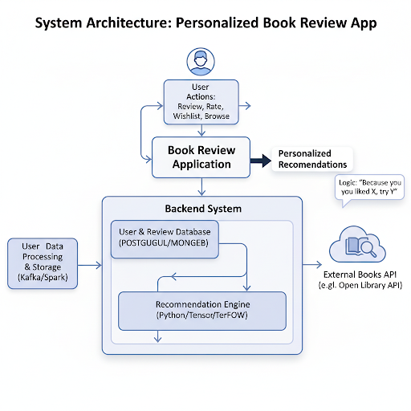

# 夏休み課題の改善案

## 2. 提案する改善機能：パーソナライズ・レコメンドエンジンの導入
今このアプリの改善点は
自分の読みたい本が明確でなく、次に何を読めばいいか探しているユーザーや普段自分では選ばないような、新しいジャンルや作家の面白い本に出会いたいユーザーにとってとても不便であり、

**「自分好みの本を探すのが大変」という課題**:
    世の中には無数の本が存在するため、自分の興味に合う一冊を見つけ出すのは時間がかかります。ランキングや話題書だけでは、本当に自分に響く本を見逃してしまう可能性があります。

**「読書体験のマンネリ化」という課題**:
    同じ作家や似たジャンルの本ばかり読んでしまい、新しい発見や感動を得る機会が少なくなることがあります。

この二つの課題が存在し、ユーザーが自ら能動的に書籍を検索しなければ、新しい本に出会う機会がランキング機能などに限定されている点です。そこで、ユーザー一人ひとりの読書傾向に合わせて最適化された書籍を推薦する**パーソナライズ・レコメンドエンジン**の導入を提案します。

具体的な機能:
1.  **トップページへの「あなたへのおすすめ」セクションの追加**:
    アプリを開くとすぐに、個々のユーザーの好みに合わせてパーソナライズされた書籍リストが表示されます。

2.  **関連書籍の提示**:
    ある書籍の詳細ページを閲覧した際に、「この本が好きなあなたには、こちらもおすすめです」といった形で、関連性の高い他の書籍を推薦します。

    **システム構成イメージ:**

## 3. 競合分析と本提案の新規性

### 競合サービス

Amazonの購買履歴に基づく推薦や、「読書メーター」「ブクログ」といった大手読書管理サービスにもレコメンド機能は存在します。

### 本提案の独自性・新規性

単に既存の機能を模倣するのではなく、以下の点で差別化を図り、独自の価値を提供します。

* **推薦理由の言語化による「納得感」の醸成**:
    なぜその本が推薦されたのか、その理由を具体的に言語化してユーザーに提示します。「あなたが星5をつけた『A』と同じ作家の作品です」「あなたが好きな『ミステリー』ジャンルの隠れた名作です」のように理由を添えることで、ユーザーは納得感を持って推薦を受け入れることができ、新たな本への興味が深まります。

* **「セレンディピティ（偶然の素敵な出会い）」の演出**:
    効率だけを追求するのではなく、アルゴリズムにあえて「揺らぎ」を持たせます。ユーザーの読書傾向から少しだけ外れた、しかし興味を持つ可能性のある本（例：好きな作家が影響を受けたと公言している古典作品など）を意図的に混ぜ込むことで、「自分では決して探さなかったであろう素晴らしい本との偶然の出会い」を創出します。これは、他のサービスにはない、本アプリならではのユニークな読書体験となります。

この機能を導入することにより、ユーザーはアプリを使うたびに新しい本と出会う楽しみを感じることができ、**アプリへのエンゲージメント（愛着や利用頻度）が大幅に向上する**ことが期待されます。

将来的には、ユーザー同士のフォロー機能や読書コミュニティ機能と連携させ、「あなたの好きなAさんが最近高評価した本」といった、**人と人との繋がりを通じた新しい本の発見**の仕組みへと拡張していくことも可能です。

以上が、本アプリをさらに発展させるための改善提案です。
